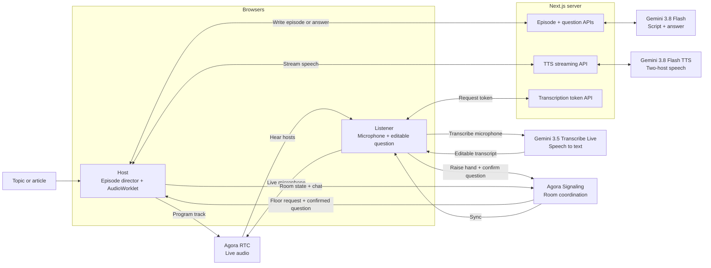

<div align="center">

# Agora Podcasts — A podcast you can join.

Turn a topic or article into a two-host show. Listen live, jump in with a question, and hear the hosts answer before the episode continues.

[](https://www.agora.io/)
[](https://ai.google.dev/)

**English** · [简体中文](./README.zh-CN.md)

</div>


## Demo

https://github.com/user-attachments/assets/b624ff06-62d6-41d7-a74e-24cfc73d7ce8

## How it works

1. **Create a show.** Enter a topic, question, notes, or an article. `gemini-3.8-flash` writes a conversation between two hosts; `gemini-3.8-flash-tts` performs it in two distinct voices. The example button fills in a topic; it does not play prerecorded audio.
2. **Broadcast it.** The host browser streams generated audio into an AudioWorklet and publishes one program track through Agora RTC. Listeners hear the same live broadcast. Agora Signaling (RTM) synchronizes the script, room state, chat, and hand raises.
3. **Join the conversation.** A listener raises a hand and asks aloud. Agora RTC carries the live microphone to the room, while `gemini-3.5-transcribe-live` transcribes it into an editable question. Speech is not sent to the hosts as a question until the listener confirms that text. Then `gemini-3.8-flash` writes a contextual answer, `gemini-3.8-flash-tts` voices the hosts, and the program resumes where it paused.

## Technical architecture



The Next.js server keeps the Gemini API key and issues short-lived tokens; the browser handles playback, RTC, Signaling, and live transcription. Agora RTC carries audio, while Agora Signaling carries room state, hand raises, confirmed questions, and chat—not the audio itself. The host controls one shared playback cursor: switching to the answer lane pauses the original episode without discarding its position.

## Run it locally

You need Node.js 22+, pnpm, an [Agora project](https://console.agora.io/) with RTC and Signaling enabled, and a Gemini API key with access to the models used below.

```bash
git clone git@github.com:zicojiao/agora-podcasts.git
cd agora-podcasts
corepack enable
pnpm install --frozen-lockfile
cp env.local.example .env.local
```

Fill in `.env.local` with your own values:

```dotenv
GEMINI_API_KEY=<your-gemini-api-key>
GEMINI_TTS_MODEL=gemini-3.8-flash-tts
GEMINI_TEXT_MODEL=gemini-3.8-flash
NEXT_PUBLIC_AGORA_APP_ID=<your-agora-app-id>
NEXT_AGORA_APP_CERTIFICATE=<your-agora-app-certificate>
```

`GEMINI_TTS_MODEL` and `GEMINI_TEXT_MODEL` default to the values shown above; override them only if needed. The microphone transcription model is currently fixed in code to `gemini-3.5-transcribe-live`. You still need API access to all three models. Keep the Gemini key and Agora certificate server-side; only the Agora App ID is intentionally public. See the [official Gemini TTS guide](https://ai.google.dev/gemini-api/docs/speech-generation) for the model and multi-speaker request format.

```bash
pnpm run doctor
pnpm run dev
```

Open [http://localhost:3000](http://localhost:3000), enter a display name, then create a room. Share the generated `?room=...` link with a second browser or device to test the listener flow. The host can also raise a hand to demonstrate an interruption alone.

## Test and deploy

```bash
pnpm run verify   # lint, types, contract tests, and production build
pnpm run smoke    # optional: calls the real Gemini API and consumes quota
```

For an end-to-end check, confirm that a fresh episode plays, the host publishes its Agora program track, a second client hears it, a question is transcribed and confirmed, and playback resumes after the answer. Local contract tests alone do not prove model access or live RTC delivery.

Deploy this as a Next.js server application and set the same environment variables on your hosting platform. Static export is not supported. The app has no built-in access gate or rate limiting: anyone who can reach a deployed instance can call its generation and token endpoints. Add quotas, abuse controls, or deployment-level protection before inviting broad traffic.

## License

[MIT](./LICENSE) © 2026 Zico Jiao.
