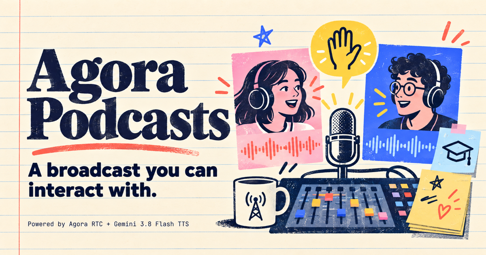
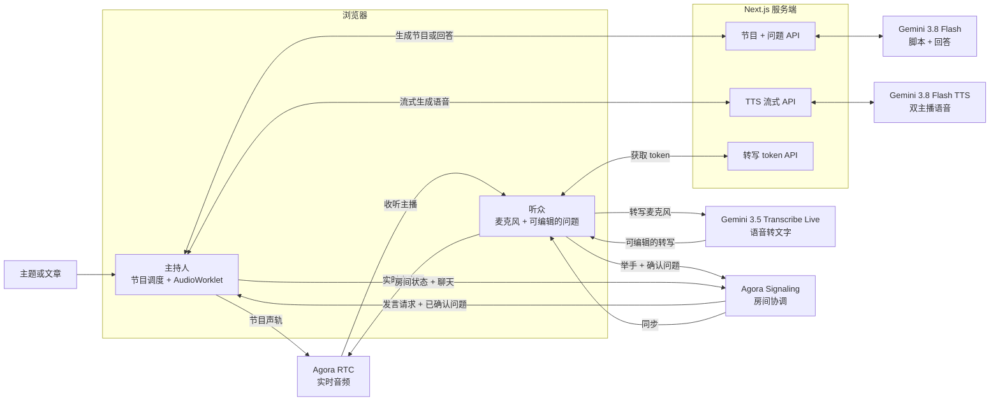

<div align="center">

# Agora Podcasts — 一个你可以加入对话的播客。

输入主题或文章，生成双主播节目；实时收听、插话提问，听两位主播回答后再继续原来的内容。

[](https://www.agora.io/)
[](https://ai.google.dev/)

[English](./README.md) · **简体中文**

</div>



## 演示视频

https://github.com/user-attachments/assets/b624ff06-62d6-41d7-a74e-24cfc73d7ce8

## 如何工作

1. **生成节目。** 输入主题、问题、笔记或文章。`gemini-3.8-flash` 写出两位主播之间的对话，`gemini-3.8-flash-tts` 用两种不同的声音演绎。首页示例按钮只填入主题，不使用预录音频。
2. **实时广播。** 主持人浏览器把生成的音频送入 AudioWorklet，再通过 Agora RTC 发布统一节目声轨。听众收听同一场广播；Agora Signaling（RTM）同步脚本、房间状态、聊天和举手事件。
3. **加入对话。** 听众举手提问，麦克风经 Agora RTC 实时传到房间，同时由 `gemini-3.5-transcribe-live` 转写为可编辑的问题。听众确认文字之前，不会把转写内容作为问题提交给主播。确认后，`gemini-3.8-flash` 写出针对问题的回答，`gemini-3.8-flash-tts` 用两位主播的声音说出来；原节目随后从暂停位置继续。

## 技术架构



Next.js 服务端保管 Gemini API key 并签发短期 token；浏览器负责播放、RTC、Signaling 和实时转写。Agora RTC 传输音频，Agora Signaling 同步房间状态、举手、已确认的问题和聊天，不传输音频。主持人控制唯一的播放位置：切换到回答声道时，原节目暂停，但不会丢失播放进度。

## 本地运行

需要 Node.js 22+、pnpm、已启用 RTC 与 Signaling 的 [Agora 项目](https://console.agora.io/)，以及能访问所需模型的 Gemini API key。

```bash
git clone git@github.com:zicojiao/agora-podcasts.git
cd agora-podcasts
corepack enable
pnpm install --frozen-lockfile
cp env.local.example .env.local
```

在 `.env.local` 中填入你自己的配置：

```dotenv
GEMINI_API_KEY=<你的-Gemini-API-key>
GEMINI_TTS_MODEL=gemini-3.8-flash-tts
GEMINI_TEXT_MODEL=gemini-3.8-flash
NEXT_PUBLIC_AGORA_APP_ID=<你的-Agora-App-ID>
NEXT_AGORA_APP_CERTIFICATE=<你的-Agora-App-Certificate>
```

`GEMINI_TTS_MODEL` 和 `GEMINI_TEXT_MODEL` 默认使用上面的值，只有需要切换模型时才覆盖。麦克风转写模型目前在代码中固定为 `gemini-3.5-transcribe-live`。调用这三个模型仍需对应的 API 权限。Gemini key 和 Agora Certificate 必须留在服务端；只有 Agora App ID 是有意公开的。模型 ID 与双人语音请求格式见 [Gemini 官方 TTS 文档](https://ai.google.dev/gemini-api/docs/speech-generation)。

```bash
pnpm run doctor
pnpm run dev
```

打开 [http://localhost:3000](http://localhost:3000)，输入显示名称并创建房间。把生成的 `?room=...` 链接发给第二个浏览器或设备，即可测试听众流程。主持人自己也可以举手，单人演示插话功能。

## 测试与部署

```bash
pnpm run verify   # lint、类型、契约测试和生产构建
pnpm run smoke    # 可选：调用真实 Gemini API，会消耗额度
```

端到端测试应确认：新节目正常播放、Agora 节目轨已发布、第二个客户端能收听、问题经过转写和确认、回答后原节目继续。本地契约测试不能证明模型权限或 RTC 实时传输。

部署时使用 Next.js 服务端运行环境，并在托管平台设置同样的环境变量；项目不支持静态导出。应用没有内置访问门禁或限流：任何能访问部署地址的人都可以调用生成与 token 接口。扩大访问范围前应增加配额、防滥用措施或部署平台的访问保护。

## 许可证

[MIT](./LICENSE) © 2026 Zico Jiao。
